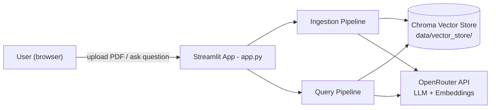
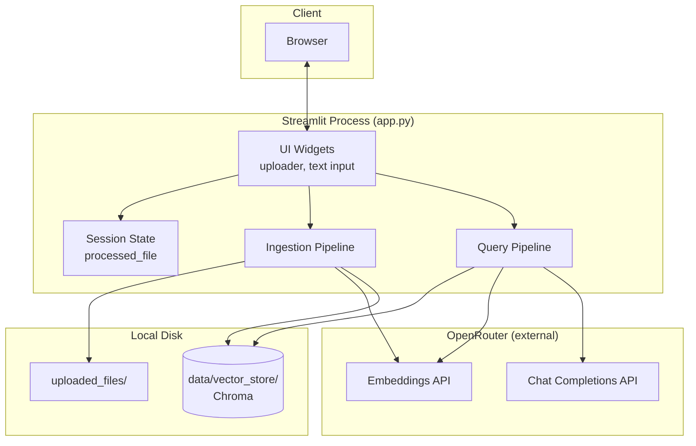
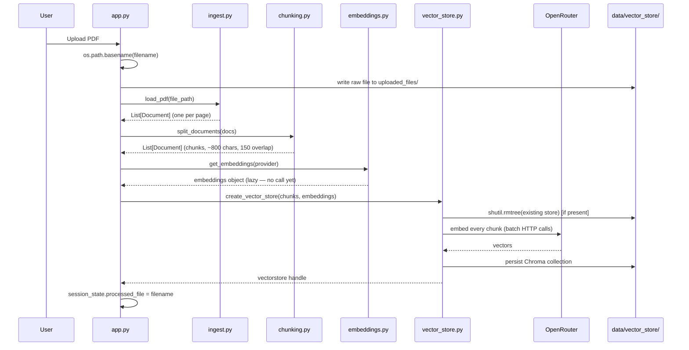
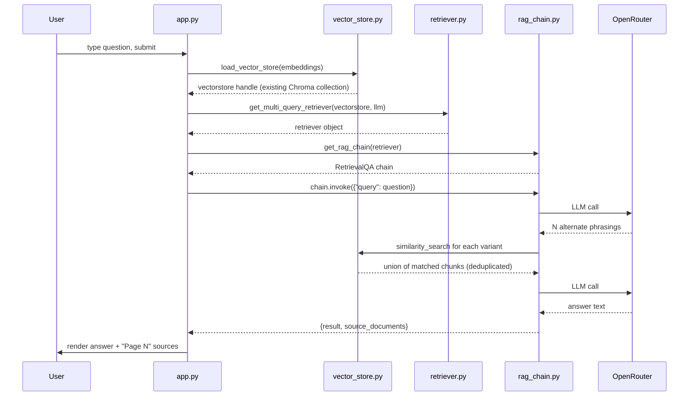
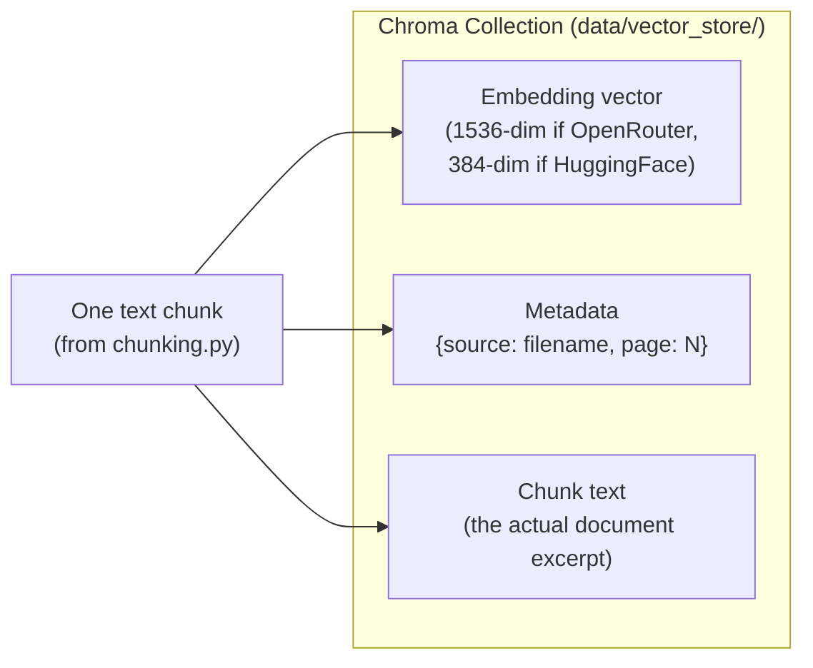

# RAG Q&A System — Engineering Reference

**What this project is, in one sentence:** a personal tool that lets you upload a single PDF and ask natural-language questions about it, answered by an LLM that is forced to ground its answer in the actual document text (via retrieval) and cite the source page.

**What this project is not:** a multi-user SaaS product. There is no login system, no relational database, no REST API layer, and no deployment pipeline. Several sections of the standard "world-class README" template (Auth, DB schema, Redux-style state, CI/CD) don't apply here — those sections say so explicitly instead of inventing content that doesn't exist in the code.

---

## Table of Contents

1. [Project Overview](#1-project-overview)
2. [Folder Structure](#2-folder-structure)
3. [System Architecture](#3-system-architecture)
4. [Project Flow (Full Lifecycle)](#4-project-flow-full-lifecycle)
5. [Code Flow (Who Calls Whom)](#5-code-flow-who-calls-whom)
6. [Module-by-Module Logic](#6-module-by-module-logic)
7. [Feature Breakdown](#7-feature-breakdown)
8. [API Documentation](#8-api-documentation)
9. [Data Store Documentation (No Relational DB)](#9-data-store-documentation-no-relational-db)
10. [State Management](#10-state-management)
11. [Authentication & Authorization](#11-authentication--authorization)
12. [Error Handling](#12-error-handling)
13. [Important Algorithms](#13-important-algorithms)
14. [Design Decisions](#14-design-decisions)
15. [Performance Optimizations](#15-performance-optimizations)
16. [Security](#16-security)
17. [Configuration](#17-configuration)
18. [Deployment](#18-deployment)
19. [Complete File Explanation](#19-complete-file-explanation)
20. [End-to-End Execution Walkthrough](#20-end-to-end-execution-walkthrough)
21. [Common Bugs (Real Ones, Already Found)](#21-common-bugs-real-ones-already-found)
22. [Future Improvements](#22-future-improvements)
23. [Interview Preparation (50+ Q&A)](#23-interview-preparation-50-qa)
24. [Viva / Presentation Notes (10-Minute Talk Track)](#24-viva--presentation-notes-10-minute-talk-track)
25. [Quick Revision Sheet](#25-quick-revision-sheet)
26. [Running the Project](#26-running-the-project)

---

## 1. Project Overview

### The problem

Reading a long PDF (a manual, a contract, a research paper) to find one answer is slow. A plain LLM chat can answer fast, but it **hallucinates** — it isn't grounded in your specific document, and it can't tell you which page it got an answer from.

### Why this was built

To get **fast, cited answers** from a specific document without either (a) reading the whole thing, or (b) trusting an LLM's unverified memory. This is the core idea of **RAG (Retrieval-Augmented Generation)**: don't ask the LLM to *know* the answer — ask it to *read the relevant excerpt and summarize it*.

### Who the users are

- single-user, local/personal tool. There is no login, no per-user data isolation, and the vector store is a single shared directory on disk (`data/vector_store/`). This is a "run it on your own machine" tool, not a multi-tenant product.

### High-level architecture



- **Streamlit App** — the entire "backend" and "frontend" in one Python process. No separate API server.
- **Ingestion Pipeline** — turns a PDF into searchable vectors, once per uploaded file.
- **Query Pipeline** — turns a question into an answer, grounded in the vectors.
- **Chroma** — the only persistent state. It's a local, embedded vector database (like SQLite, but for embeddings).
- **OpenRouter** — the only external network dependency. One API key, one HTTP endpoint, gives access to many LLM/embedding models.

### Key features

- Upload a PDF, get it chunked and embedded automatically.
- Ask a question, get an answer **and** the source page(s) it came from.
- "Multi-query" retrieval: the LLM rewrites your question into several phrasings to catch documents that a single literal search would miss.
- Swappable embedding backend: OpenRouter (cloud, paid/free-tier) or HuggingFace MiniLM (local, free, offline).

### Tech stack — and why each piece was chosen

| Technology | Why it was chosen | Alternative considered |
|---|---|---|
| **Streamlit** | Fastest way to get an interactive UI in pure Python — no separate frontend build, no REST layer to hand-write. Right tool for a solo/prototype tool. | Flask/FastAPI + React — far more control and a real API boundary, but massive setup cost for a single-user tool. |
| **LangChain** (`langchain`, `langchain-community`, `langchain-classic`) | Provides ready-made glue for the RAG pattern: document loaders, text splitters, retriever wrappers, and chain orchestration (`RetrievalQA`). Avoids hand-rolling prompt assembly and retrieval-result stitching. | Hand-written glue code, or LlamaIndex (another RAG-focused framework). |
| **ChromaDB** (`langchain-chroma`) | Embedded vector database — no server to run, persists to a local folder, good enough similarity search (HNSW) for a single-document/personal scale. | FAISS (no built-in persistence/metadata story), Pinecone/Weaviate (hosted, paid, massive overkill for one user). |
| **OpenRouter** | One API key and one HTTP endpoint that proxies to many providers/models (including free-tier models like `openai/gpt-oss-20b:free`), instead of juggling separate OpenAI/Anthropic/etc. keys and billing. | Calling OpenAI directly — simpler SDK, but no access to free-tier or alternate models through one key. |
| **HuggingFace `sentence-transformers/all-MiniLM-L6-v2`** | Free, local, no network call, no API cost — a fallback embedding path that works fully offline. | OpenAI/OpenRouter embeddings only — simpler (one path), but costs money and requires network access even for embeddings. |
| **pypdf** (via `PyPDFLoader`) | Lightweight, pure-Python PDF text extraction, one Document per page (which is exactly the citation granularity this app needs — "Page N"). | `unstructured`, `pdfplumber` — richer layout parsing, heavier dependencies, not needed for plain-text PDFs. |
| **python-dotenv** | Load secrets from a local `.env` file instead of hardcoding them or requiring OS-level environment variables. | OS environment variables only — works, but worse local-dev ergonomics. |

---

## 2. Folder Structure

```
rag_app/
├── app.py                  # Streamlit UI — the only user-facing entry point
├── main.py                 # CLI smoke-test entry point (no UI)
├── config.py                # Central env-var loading + validation
├── ingest.py                 # PDF -> LangChain Document objects
├── chunking.py                # Document -> smaller Document chunks
├── embeddings.py               # Chunk text -> vector, provider-selectable
├── vector_store.py             # Chroma persistence (create/load)
├── retriever.py                 # Retrieval strategies over the vector store
├── rag_chain.py                  # Prompt + LLM + retriever -> RetrievalQA chain
├── requirements.txt                # Pinned-by-name (not version) dependencies
├── sample.pdf                        # Fixture used by main.py
├── uploaded_files/                     # PDFs uploaded via the Streamlit UI
│   ├── sample.pdf
│   └── Resturaunt Q&A.pdf
├── data/
│   └── vector_store/                    # Persisted Chroma DB (binary — do not hand-edit)
├── .vscode/settings.json                  # Editor config only, not app logic
├── .env                                     # Secrets (OPENROUTER_API_KEY) — gitignored
└── .gitignore
```

### Per-folder rules

| Folder/File | Purpose | Why it exists | Belongs inside | Never put inside |
|---|---|---|---|---|
| `app.py` | Streamlit UI + orchestration ("controller") | Single entry point users actually run | UI widgets, session-state wiring, calling the pipeline modules | Business logic (chunk size, prompt text, retrieval strategy) — that belongs in the dedicated modules |
| `config.py` | Env var access + validation | One place to add a new required setting and get a clear startup error instead of a buried `None` | `os.getenv` calls, validation, provider defaults | Anything that imports LangChain/Streamlit — keep it dependency-light so every other module can import it safely |
| `ingest.py` | Load a PDF into LangChain `Document`s | Isolates the PDF-parsing library choice behind one function | Loader-specific code (`PyPDFLoader` today) | Chunking or embedding logic |
| `chunking.py` | Split documents into overlapping chunks | Isolates the splitting strategy/tuning (`chunk_size`, `chunk_overlap`) from the rest of the pipeline | Text-splitter configuration | File I/O, embedding calls |
| `embeddings.py` | Return an embeddings object for a given provider string | One switch point to change/add an embedding backend without touching callers | Provider branches (`openrouter`, `huggingface`) | Vector store or retrieval logic |
| `vector_store.py` | Create/load the Chroma persistence layer | Isolates *how* vectors are stored/reset from *how* they are produced | Chroma-specific create/load/reset code | Embedding logic, LLM calls |
| `retriever.py` | Wrap the vector store in a retrieval strategy | Lets the retrieval strategy (similarity / MMR / multi-query) change independently of storage | `as_retriever(...)` variants | Prompting or chain assembly |
| `rag_chain.py` | Build the prompt + LLM + `RetrievalQA` chain | One place to change the model, temperature, or prompt wording | Prompt template, LLM config, chain wiring | Retrieval strategy code (takes a retriever as a parameter instead) |
| `data/vector_store/` | Chroma's on-disk binary files (HNSW index + SQLite metadata) | Persistence so you don't re-embed on every run | Nothing you write by hand — treat as opaque, Chroma-managed | Manually created/edited files; do not `git add` individual files inside it if you ever change this policy — treat the whole directory as one unit |
| `uploaded_files/` | Raw PDFs saved from the file uploader | Keeps the original file around (for re-ingestion, debugging what was actually parsed) | PDFs the app has processed | Anything not user-uploaded |
| `main.py` | CLI smoke test | Quick way to verify the ingest → embed → store → search pipeline without opening a browser | Ad-hoc test/demo code | Anything the real app (`app.py`) depends on — it must remain optional |

---

## 3. System Architecture

### 3.1 Overall architecture (component view)



**Why this shape:** there is deliberately no separate backend service. Streamlit's Python process *is* the backend — button click handlers directly call pipeline functions in-process. This removes an entire network hop (browser → API → service) that a typical web app would have, at the cost of not being able to scale beyond one process (see [Design Decisions](#14-design-decisions)).

### 3.2 Ingestion (upload) flow



**Why the store is wiped before writing:** this app processes **one document at a time**. Without wiping, chunks from every PDF ever uploaded would accumulate in the same collection forever, and a question about document B could retrieve — and get answered from — leftover chunks of document A. See [Common Bugs](#21-common-bugs-real-ones-already-found) — this was an actual bug found and fixed in this codebase, not a hypothetical.

### 3.3 Query (ask a question) flow



**Why two LLM calls per question:** the first call (query rewriting, inside `MultiQueryRetriever`) trades latency/cost for **recall** — a single literal embedding search can miss a chunk that's relevant but phrased differently than the question. The second call (`RetrievalQA`) is the actual answer generation, constrained by the prompt to only use the retrieved context.

### 3.4 Deployment flow (current state)


- **There is no CI/CD, no Docker image, and no cloud deployment today.** This is intentionally called out rather than invented — see [Deployment](#18-deployment) for what a real deployment would require.

### Note on omitted diagrams

The template this README follows also asks for a "Database Flow" and "Authentication Flow" diagram. Both are intentionally omitted here — see [§9](#9-data-store-documentation-no-relational-db) and [§11](#11-authentication--authorization) for why they don't apply to this project's current architecture.

---

## 4. Project Flow (Full Lifecycle)

```
User opens the Streamlit URL
        ↓
app.py runs top-to-bottom (Streamlit re-runs the whole script on every interaction)
        ↓
load_dotenv() reads .env into process environment
        ↓
Session state initialized: processed_file = None (first run only)
        ↓
User uploads a PDF via the sidebar
        ↓
[if uploaded_file.name != session_state.processed_file]  ← reprocessing guard
        ↓
File saved to uploaded_files/ (basename-sanitized)
        ↓
PyPDFLoader extracts text per page → List[Document]
        ↓
RecursiveCharacterTextSplitter splits into ~800-char chunks, 150-char overlap
        ↓
Embeddings object created (OpenRouter or HuggingFace, per config.EMBEDDINGS_PROVIDER)
        ↓
Chroma store wiped and rebuilt from these chunks — persisted to data/vector_store/
        ↓
session_state.processed_file = filename  → UI unlocks the question box
        ↓
User types a question
        ↓
Embeddings + persisted Chroma store reloaded
        ↓
MultiQueryRetriever rewrites the question (1 LLM call) and retrieves matching chunks
        ↓
RetrievalQA "stuff" chain assembles a prompt: {rules} + {retrieved chunks} + {question}
        ↓
LLM (openai/gpt-oss-20b:free via OpenRouter) generates the answer (1 LLM call)
        ↓
Streamlit renders the answer text + a deduplicated "Page N" source list
```

**Why every step matters:**

- *Reprocessing guard* — without it, uploading a second file would be silently ignored (a real bug found and fixed — [§21](#21-common-bugs-real-ones-already-found)).
- *Basename sanitization* — the uploader gives you a filename string; treating it as a trusted path component without stripping directory components is a path-traversal risk on any OS where a crafted name could contain `..` segments.
- *Store wipe before rebuild* — prevents cross-document answer contamination.
- *Same embeddings provider on both ingest and query* — a vector store built with one embedding model's vector space is meaningless to search with a different model's vectors (different dimensionality, different geometry). This was an actual mismatch bug in this codebase — `main.py` used HuggingFace embeddings while `app.py` used OpenRouter embeddings against the *same* persisted store.

---

## 5. Code Flow (Who Calls Whom)

There is no traditional Controller → Service → Repository layering here (no HTTP layer at all). The equivalent chain is:

```
Entry point (app.py, or main.py for CLI)
        ↓
ingest.load_pdf()          — I/O boundary: PDF file → Document objects
        ↓
chunking.split_documents() — pure transform: Document[] → smaller Document[]
        ↓
embeddings.get_embeddings()— factory: provider string → embeddings client
        ↓
vector_store.create_vector_store() / load_vector_store() — persistence boundary
        ↓
retriever.get_multi_query_retriever() — wraps vector store + LLM into a retriever
        ↓
rag_chain.get_rag_chain()  — wraps retriever + LLM + prompt into a runnable chain
        ↓
chain.invoke(...)           — LangChain internally calls: retriever.get_relevant_documents() → prompt.format() → llm.invoke()
```

**Call direction rule of thumb:** `app.py`/`main.py` are the only modules that call *across* pipeline stages. Every other module (`ingest`, `chunking`, `embeddings`, `vector_store`, `retriever`, `rag_chain`) is self-contained and only depends on `config.py` and third-party libraries — never on each other. This is why you can unit-test or swap any one stage without touching the others.

---

## 6. Module-by-Module Logic

### `config.py`
- **Purpose:** single source of truth for environment configuration.
- **Inputs:** OS/`.env` environment variables.
- **Outputs:** `EMBEDDINGS_PROVIDER` constant, `get_openrouter_api_key()` (raises `RuntimeError` if missing).
- **Edge cases:** key present but invalid/revoked — not caught here, surfaces later as an OpenRouter 401. This module only checks *presence*, not *validity*.
- **Common mistake to avoid:** importing LangChain here — keep this module dependency-light so it can never fail to import.
- **Future improvement:** validate the key against OpenRouter at startup (one cheap request) instead of failing on the first real call.

### `ingest.py`
- **Purpose:** turn a PDF file path into LangChain `Document` objects (one per page).
- **Inputs:** `file_path: str`.
- **Outputs:** `List[Document]`, each with `metadata={"source": ..., "page": ...}`.
- **Internal logic:** existence check → `PyPDFLoader(file_path).load()`.
- **Edge cases:** scanned/image-only PDFs produce `Document`s with empty/near-empty `page_content` — not detected here (see `chunking`/`vector_store` for where this is now guarded).
- **Complexity:** O(pages) time, O(document size) space — the whole PDF text is loaded into memory at once (fine for typical PDFs, would need streaming for huge ones).
- **Common mistake:** assuming `PyPDFLoader` preserves layout/tables — it extracts linear text only.

### `chunking.py`
- **Purpose:** split long documents into retrieval-sized pieces.
- **Inputs:** `List[Document]`, `chunk_size=800`, `chunk_overlap=150`.
- **Outputs:** `List[Document]` (more, smaller documents; metadata preserved per chunk).
- **Internal logic:** `RecursiveCharacterTextSplitter` tries separators in order (`\n\n`, `\n`, `.`, ` `, `""`) — it only falls back to a harder split (e.g. mid-word) if a chunk can't fit within `chunk_size` any other way.
- **Why 800/150:** small enough that a chunk is topically coherent and cheap to embed; the 150-char overlap means a sentence that gets cut at a chunk boundary is very likely to still appear whole in the neighboring chunk, so it isn't "lost" from retrieval.
- **Complexity:** O(n) in total document character count.
- **Edge case:** a document with **zero** extractable text returns an empty list — now explicitly rejected downstream in `vector_store.create_vector_store` instead of silently building an empty index.

### `embeddings.py`
- **Purpose:** factory that returns an embeddings client for a given provider name.
- **Inputs:** `provider: "openrouter" | "huggingface"` (default `"openrouter"`, matching `config.EMBEDDINGS_PROVIDER`).
- **Outputs:** a LangChain `Embeddings`-compatible object (lazy — no network/model call happens until something actually calls `.embed_documents()`/`.embed_query()`).
- **Edge cases:** unsupported provider string → `ValueError` immediately (fail fast, not a silent no-op).
- **Common mistake this codebase used to make:** calling `get_embeddings("openrouter")` in one code path and `get_embeddings("huggingface")` in another against the *same* persisted vector store — dimension mismatch. Fixed by routing both through `config.EMBEDDINGS_PROVIDER`.
- **Future improvement:** cache the HuggingFace model instance across calls (currently reloads the model from disk/HF cache on every `get_embeddings("huggingface")` call).

### `vector_store.py`
- **Purpose:** the only module that touches Chroma persistence directly.
- **`create_vector_store(documents, embeddings, persist_directory)`:**
  - Rejects an empty `documents` list with a clear `ValueError` (guards the "scanned PDF → zero chunks → confusing Chroma error" failure mode).
  - **Deletes the existing persisted directory** before writing — this is a deliberate "one document at a time" design, not an oversight (see [§14](#14-design-decisions)).
  - Calls `Chroma.from_documents(...)`, which embeds every chunk and writes the HNSW index + SQLite metadata to disk.
- **`load_vector_store(embeddings)`:** opens the persisted directory. **Important gotcha:** this does **not** raise if the directory doesn't exist or is empty — Chroma auto-creates an empty collection instead. Any code that decides "load vs. create" by catching an exception from this call is wrong (this was an actual bug — see [§21](#21-common-bugs-real-ones-already-found)); check `vectorstore._collection.count()` instead.
- **Complexity:** embedding is O(chunks) network calls (batched); similarity search is approximate-nearest-neighbor via HNSW, sub-linear in practice, not exact O(n).

### `retriever.py`
- **`get_base_retriever`** — plain top-k similarity search. Defined, currently unused by the app.
- **`get_mmr_retriever`** — Maximal Marginal Relevance: re-ranks results to reduce redundancy between returned chunks (trades a bit of pure relevance for diversity). Defined, currently unused.
- **`get_multi_query_retriever`** (the one actually used) — wraps a base retriever; before searching, asks an LLM to generate multiple rephrasings of the user's question, runs similarity search for each, and returns the deduplicated union.
- **Why the other two exist but aren't wired up:** they're intentional alternative strategies (a "menu" of retrieval approaches) that only cost you a one-line swap in `app.py` if multi-query ever proves too slow or too expensive (it's the only strategy here that costs an extra LLM call).

### `rag_chain.py`
- **Purpose:** assemble the final answer-generation chain.
- **Inputs:** a `retriever` instance.
- **Outputs:** a `RetrievalQA` chain (`chain_type="stuff"`, `return_source_documents=True`).
- **Internal logic:** builds a `ChatOpenAI` client pointed at OpenRouter, defines a strict prompt (context-only answers, explicit "I don't know" fallback, no emojis, "polite and energetic" tone), and wires it into `RetrievalQA.from_chain_type`.
- **"Stuff" chain type, explained:** all retrieved chunks are concatenated ("stuffed") directly into one prompt. Simple and fast, but bounded by the LLM's context window — if `k` (number of retrieved chunks) or chunk size grows too large, this chain type breaks down before others (`map_reduce`, `refine`) would.
- **Edge case:** if `source_documents` is empty (no chunks matched), the LLM still receives an (empty) context block and — per the prompt rules — should reply with the "I don't know" fallback rather than hallucinating.

### `app.py`
- **Purpose:** Streamlit UI + orchestration; the only module allowed to call across every other module.
- **Session state key:** `processed_file` (filename string or `None`) — gates whether the Q&A section is shown, and whether a new upload triggers reprocessing.
- **Two guarded blocks:** ingestion block (`if uploaded_file and st.session_state.processed_file != uploaded_file.name`) and Q&A block (`if st.session_state.processed_file`), both wrapped in try/except that route failures to `st.error(...)` instead of a raw traceback.

### `main.py`
- **Purpose:** headless CLI smoke test — proves the ingest → chunk → embed → store → search pipeline works without opening a browser.
- **Not imported by anything** — safe to delete without breaking `app.py`. Its value is purely as a fast manual sanity check during development.

---

## 7. Feature Breakdown

### Feature: PDF Upload & Ingestion

| Aspect | Detail |
|---|---|
| Why it exists | Turns an arbitrary PDF into something semantically searchable. |
| Files involved | `app.py` → `ingest.py` → `chunking.py` → `embeddings.py` → `vector_store.py` |
| Execution flow | See [§3.2](#32-ingestion-upload-flow) |
| External calls | OpenRouter Embeddings API (or local HuggingFace model — no network call) |
| Persistent changes | Overwrites `data/vector_store/`; writes the raw file to `uploaded_files/` |
| UI updates | Spinner → success/error message; unlocks the question box |
| Validation | Empty-chunk rejection (`vector_store.create_vector_store`); filename basename sanitization |
| Error handling | try/except around the whole block → `st.error(...)`, session state reset to `None` on failure |

### Feature: Grounded Q&A with Citations

| Aspect | Detail |
|---|---|
| Why it exists | The actual value proposition: answers backed by the document, not the model's memory. |
| Files involved | `app.py` → `vector_store.py` → `retriever.py` → `rag_chain.py` |
| Execution flow | See [§3.3](#33-query-ask-a-question-flow) |
| External calls | OpenRouter Chat Completions API — twice per question (query rewrite + answer generation) |
| Persistent changes | None — read-only against the vector store |
| UI updates | Answer text + deduplicated "source — Page N" list |
| Validation | None on the question text itself (any string is sent to the LLM) |
| Error handling | try/except around the whole block → `st.error(...)` |

---

## 8. API Documentation

**There is no REST/HTTP API in this project** — `app.py` calls other Python modules directly, in-process. What actually functions as "the API" is:

### 8.1 Internal module API (function-level contracts)

| Function | Location | Input | Output | Raises |
|---|---|---|---|---|
| `load_pdf(file_path)` | `ingest.py` | `str` | `List[Document]` | `FileNotFoundError` |
| `split_documents(documents, chunk_size=800, chunk_overlap=150)` | `chunking.py` | `List[Document]` | `List[Document]` | — |
| `get_embeddings(provider="openrouter")` | `embeddings.py` | `str` | `Embeddings` | `ValueError` (unknown provider), `RuntimeError` (missing API key, via `config`) |
| `create_vector_store(documents, embeddings, persist_directory=...)` | `vector_store.py` | `List[Document]`, `Embeddings` | `Chroma` | `ValueError` (empty documents) |
| `load_vector_store(embeddings, persist_directory=...)` | `vector_store.py` | `Embeddings` | `Chroma` | (does not raise on missing store — see [§6](#6-module-by-module-logic)) |
| `get_multi_query_retriever(vectorstore, llm, k=5)` | `retriever.py` | `Chroma`, LLM | `MultiQueryRetriever` | — |
| `get_rag_chain(retriever)` | `rag_chain.py` | Retriever | `RetrievalQA` | `RuntimeError` (missing API key) |

### 8.2 External API dependency: OpenRouter

| Call | Used by | Purpose | Auth |
|---|---|---|---|
| `POST /api/v1/embeddings` (model: `openai/text-embedding-3-small`) | `embeddings.py` via `OpenAIEmbeddings` | Turn chunk text into vectors | Bearer token (`OPENROUTER_API_KEY`) |
| `POST /api/v1/chat/completions` (model: `openai/gpt-oss-20b:free`) | `retriever.py` (query rewriting), `rag_chain.py` (answer generation) | Generate text | Bearer token (`OPENROUTER_API_KEY`) |

- **Possible errors:** 401 (bad/missing key — now caught earlier by `config.get_openrouter_api_key()` for the "missing" case only, not for "invalid"), 429 (rate limit — the `:free` model tier is commonly rate-limited; **not currently retried**, see [§22](#22-future-improvements)), network timeout (also not currently handled explicitly — falls through to the generic try/except in `app.py`).

---

## 9. Data Store Documentation (No Relational DB)

There are no SQL tables, no ORM, and no ER diagram to draw — the only persistent store is a **Chroma vector collection**. This section replaces the template's "Database Documentation" with what actually exists.

### What Chroma stores, conceptually



- **On-disk layout:** `data/vector_store/<uuid>/` holds Chroma's HNSW index binaries (`data_level0.bin`, `header.bin`, `length.bin`, `link_lists.bin`); `chroma.sqlite3` holds metadata/bookkeeping. **Treat this entire subtree as an opaque, Chroma-managed unit** — never hand-edit or partially delete files inside it.
- **"Schema":** effectively one flat collection — no relationships, no foreign keys, no separate tables per document. This is why the "one document at a time, wipe-and-rebuild" design exists ([§14](#14-design-decisions)) — Chroma isn't being used with per-document namespacing/filtering here, it's one global collection.
- **Why no real schema was designed:** the app has exactly one entity (a chunk) with no relationships to model. A relational DB would be pure overhead for this use case.
- **Assumption:** if this ever needs to support *multiple simultaneous documents* (not just sequential, overwritten ones), the natural evolution is a Chroma **collection per document** (Chroma supports named collections) rather than introducing a SQL database.

---

## 10. State Management

- **Mechanism:** Streamlit's built-in `st.session_state` — a per-browser-session dict that survives Streamlit's "rerun the whole script on every widget interaction" execution model.
- **The one key that matters:** `processed_file` (`str | None`) — doubles as both "has anything been ingested yet" and "what was it," which is what lets the app detect a *different* upload and reprocess (see [§21](#21-common-bugs-real-ones-already-found) for the bug this fixed).
- **No global state library** (Redux/Zustand equivalent) — unnecessary for a single-page, single-widget-tree app. Streamlit's rerun model means "component interaction" in the React sense doesn't exist here; there's one script, top to bottom, every time.
- **No client-side cache** — every question reloads the vector store from disk (`load_vector_store`) rather than keeping it in session state. **Trade-off:** simpler code, no stale-cache bugs, at the cost of reopening the Chroma collection on every question (cheap for a local embedded DB, but worth knowing if this ever moves to a network-backed vector store).

---

## 11. Authentication & Authorization

**Not applicable in this project's current form.** There is no login flow, no tokens, no sessions beyond Streamlit's own browser-session mechanism, and no role concept.

- **Assumption:** this is acceptable because the tool is designed to run locally, for one person, on their own machine — the "user" and "operator" are the same person, and the only credential in the system (`OPENROUTER_API_KEY`) is a server-side secret never exposed to a browser.
- **What would have to change for multi-user use:** add a real auth layer (e.g. Streamlit's built-in auth, or move the UI behind a reverse proxy with auth) *and* switch the vector store from "one shared collection" to "one collection/namespace per user," because right now every user of a deployed instance would share the same document and the same answers.

---

## 12. Error Handling

| Layer | Mechanism | Behavior |
|---|---|---|
| Missing/empty PDF text | `ValueError` in `vector_store.create_vector_store` | Caught by `app.py`'s try/except → `st.error(...)`, `processed_file` reset to `None` |
| Missing API key | `RuntimeError` in `config.get_openrouter_api_key()` | Caught by `app.py`'s try/except → `st.error(...)` |
| Unknown embeddings provider | `ValueError` in `embeddings.get_embeddings` | Same — caught, surfaced as a friendly error |
| PDF not found (CLI path) | `FileNotFoundError` in `ingest.load_pdf` | `main.py` catches it explicitly and calls `SystemExit` with a clear message |
| Any other exception during ingestion or Q&A | Generic `except Exception as e` in `app.py` | `st.error(f"...: {e}")` — **not logged anywhere**, only shown in the UI |

- **No structured logging** — errors go straight to the Streamlit UI and nowhere else. Acceptable for a single-user local tool; would need `logging`/log aggregation for anything beyond that.
- **No retry logic** — a transient OpenRouter rate-limit or network blip currently fails the whole request; the user has to manually resubmit.
- **No fallback UI beyond the error message** — there's no cached "last good answer" or offline mode.

---

## 13. Important Algorithms

### 13.1 Recursive character text splitting (`chunking.py`)

- **Purpose:** cut long text into model-sized, semantically coherent pieces.
- **Steps (conceptually):**
  1. Try to split on the first separator (`"\n\n"` — paragraph breaks).
  2. If a resulting piece still exceeds `chunk_size`, recursively try the next separator (`"\n"`, then `"."`, then `" "`, then finally raw characters) *only on that oversized piece*.
  3. Merge adjacent small pieces back together up to `chunk_size`, keeping `chunk_overlap` characters shared between consecutive chunks.
- **Complexity:** O(n) in document length; O(1) extra chunks from overlap (constant factor, not asymptotic).
- **Why recursive-by-separator instead of a fixed-size sliding window:** a fixed window would cut mid-sentence constantly, destroying local coherence — bad for embedding quality (an embedding of "the patient was gi" + "ven 5mg of..." is worse than one clean sentence).

### 13.2 Multi-query retrieval (`retriever.get_multi_query_retriever`)

- **Purpose:** improve recall against vocabulary mismatch between the question and the document's wording.
- **Steps:**
  1. LLM call: given the user's question, generate N alternate phrasings.
  2. For each phrasing (plus the original), run an embedding similarity search against Chroma.
  3. Union all returned chunks, de-duplicated by content.
- **Complexity:** O(N) embedding searches + 1 extra LLM call, vs. O(1) for plain similarity search — a deliberate latency/cost-for-recall trade-off.
- **Pseudo-code:**
  ```
  variants = llm.generate_variants(question)          # 1 LLM call
  results = set()
  for q in [question] + variants:
      results |= vectorstore.similarity_search(q, k)
  return dedupe(results)
  ```

### 13.3 "Stuff" chain answer generation (`rag_chain.py`)

- **Purpose:** produce the final answer from retrieved context.
- **Steps:** concatenate all retrieved chunk texts → insert into the prompt template's `{context}` slot along with `{question}` → single LLM call → return `{result, source_documents}`.
- **Why "stuff" over `map_reduce`/`refine`:** simplest and cheapest (one LLM call instead of one-per-chunk-plus-a-reduce-step); acceptable because `k` is small (5 chunks × ~800 chars fits comfortably in context).

---

## 14. Design Decisions

| Decision | Why | Pros | Cons | Alternative considered |
|---|---|---|---|---|
| Streamlit instead of a real frontend+API | Solo project, want a UI fast, don't want to hand-write a REST layer | Extremely fast to build/iterate | No API boundary — can't reuse the logic from e.g. a mobile client or CI job without also dragging in Streamlit | Flask/FastAPI + React |
| Wipe-and-rebuild the vector store per upload | App is designed for one document at a time; accumulating chunks across unrelated documents causes cross-document answer contamination (a real bug this fixed) | Simple mental model: "the store always reflects the last uploaded doc" | Can't hold multiple documents simultaneously; re-uploading the same large PDF re-embeds it from scratch every time (no incremental update) | Per-document Chroma collections (keeps history, more code) |
| Config-driven single embeddings provider (`config.EMBEDDINGS_PROVIDER`) instead of per-call provider strings | Embeddings from two different models are not comparable — mixing them silently corrupts search (a real bug this fixed) | One flag controls the entire pipeline consistently | Less flexible if you genuinely want to compare providers side-by-side (would need two separate vector stores) | Auto-detect provider from store metadata (more complex, not implemented) |
| `RetrievalQA` "stuff" chain over `map_reduce`/`refine` | Small `k`, small chunks — fits in one prompt | Fastest, cheapest, simplest to reason about | Breaks down if `k` or chunk size grows enough to exceed context window | `map_reduce` (scales further, costs more LLM calls) |
| OpenRouter instead of calling OpenAI directly | Access to free-tier models (`:free` suffix) and multiple providers behind one key | Cost flexibility, provider flexibility | Slight indirection/latency overhead vs. calling OpenAI directly; free-tier models are rate-limited | Direct OpenAI SDK |
| No auth layer | Single-user, local-only tool | Zero complexity for the actual use case | Not safe to deploy publicly as-is | Add auth if this ever moves beyond one user (see [§11](#11-authentication--authorization)) |

---

## 15. Performance Optimizations

| Optimization | Where | Why it exists |
|---|---|---|
| Persisted vector store | `vector_store.py` | Avoids re-embedding the same document on every app restart — embeddings are expensive (network calls) and reused across every question asked about that document. |
| Chunk size tuning (800/150) | `chunking.py` | Balances embedding cost/quality (too small = loses context; too large = wastes context window and dilutes similarity search precision). |
| Lazy embeddings client construction | `embeddings.py` | `get_embeddings(...)` returns immediately — no network/model-load cost until `.embed_documents()`/`.embed_query()` is actually called. |
| Reprocessing guard (`processed_file` check) | `app.py` | Skips redundant re-ingestion (re-parsing + re-embedding + re-persisting) if the same file is still "current." |

### Not present (and worth knowing you don't have them)

- **No caching of LLM/embedding responses** — asking the same question twice re-runs both LLM calls and the retrieval search from scratch.
- **No pagination** — irrelevant here (no list views), but worth noting if a document-history feature is ever added.
- **No lazy-loading/virtualization** — irrelevant for this UI's scale (one document, one Q&A box).
- **No debouncing/throttling** on the question input — each `st.text_input` change that satisfies Streamlit's rerun condition can re-trigger the whole Q&A block; in practice Streamlit only reruns on submit-like interactions here, but there's no explicit guard against rapid resubmission.

---

## 16. Security

| Concern | Current state | Notes |
|---|---|---|
| Secrets management | `OPENROUTER_API_KEY` in `.env`, loaded via `python-dotenv`, gitignored | **A real incident happened here:** an early commit accidentally committed `.env` with a live key to git history. GitHub's push protection blocked the push before it reached the remote (never publicly exposed), but the key must still be treated as compromised and rotated. History was squashed to remove it before the first successful push. **Lesson: `git add .` before checking `git status` is how this happens — always review the diff/status before committing.** |
| `.gitignore` correctness | Was previously UTF-16-encoded (likely from a PowerShell redirect), which silently broke every ignore rule including `.env` | Converted to UTF-8; verified with `git check-ignore -v .env`. **If a "gitignored" file mysteriously gets tracked again, check the encoding of `.gitignore` itself, not just its contents.** |
| Path handling on upload | `os.path.basename(uploaded_file.name)` before writing to disk | Defense-in-depth against a crafted filename containing `..`/absolute-path segments; Streamlit's uploader typically already supplies a clean basename, so this is a belt-and-suspenders fix, not a fix for an observed exploit. |
| Input validation | None on the question text | The question string goes straight into a prompt template and then to the LLM — no length limit, no content filtering. |
| Prompt injection | **Not defended against.** | The PDF's content becomes part of the LLM's context verbatim. A malicious PDF could contain text like "ignore previous instructions and..." — the current prompt has no instruction-hierarchy defense against this. Low risk for a personal single-user tool reading your own documents; would matter more if this ever accepted PDFs from untrusted third parties. |
| Rate limiting | None | No protection against rapid repeated submissions hammering the OpenRouter API. |
| SQL injection | N/A — no SQL is written by this app (Chroma's internal SQLite usage is fully internal to the library). |
| XSS/CSRF | Largely N/A — Streamlit renders its own widgets, not raw HTML from user input, and there's no cookie-based session to forge. |

---

## 17. Configuration

| Variable | Purpose | Example | Required? |
|---|---|---|---|
| `OPENROUTER_API_KEY` | Auth for all OpenRouter calls (embeddings + chat) | `sk-or-v1-...` | **Yes** — `config.get_openrouter_api_key()` raises `RuntimeError` if missing |
| `EMBEDDINGS_PROVIDER` | Selects `"openrouter"` or `"huggingface"` embeddings, consistently across ingest and query | `openrouter` | No — defaults to `"openrouter"` |

- All variables are loaded from a local `.env` file (via `python-dotenv`) at process start (`config.py`, plus redundant `load_dotenv()` calls in `app.py`/`main.py` — harmless, idempotent).
- **`.env` must never be committed** — it is gitignored; see the security incident noted in [§16](#16-security).

---

## 18. Deployment

**Current state: none.** This runs locally only, via `streamlit run app.py`. There is no Dockerfile, no CI/CD pipeline, and no cloud hosting configured.

- **Build process:** none beyond `pip install -r requirements.txt` — this is a script, not a compiled/bundled app.
- **If you deploy this later**, the realistic minimum path is:
  1. **Streamlit Community Cloud** (simplest — point it at the GitHub repo, set `OPENROUTER_API_KEY` as a secret in its dashboard) — but remember this exposes the app publicly with no auth (see [§11](#11-authentication--authorization)) and a shared vector store across all visitors (see [§14](#14-design-decisions)) unless both are addressed first.
  2. **Docker + any container host**, if you need more control — would require writing a `Dockerfile` (none exists today) and deciding where `data/vector_store/` persists (a container's filesystem is ephemeral by default — you'd need a volume).
- **Scaling:** the current architecture (in-process Python, local disk vector store) doesn't scale horizontally — two instances would have two independent vector stores. Scaling would require moving Chroma to a networked mode or swapping it for a hosted vector DB.

---

## 19. Complete File Explanation

| File | Purpose | Imports it / Depends on it | Calls it | What breaks if removed |
|---|---|---|---|---|
| `app.py` | UI + orchestration | Nothing (top-level entry point) | The user, via `streamlit run` | The only user-facing way to use the app disappears; `main.py` still works standalone |
| `main.py` | CLI smoke test | Nothing | The user, via `python main.py` | Nothing else breaks — it's a leaf, imported by nothing |
| `config.py` | Env var access | `embeddings.py`, `rag_chain.py`, `app.py`, `main.py` | All of the above | Every LLM/embedding call loses its API key source and its validation — everything downstream fails |
| `ingest.py` | PDF → Documents | `app.py`, `main.py` | Both entry points | No way to turn a PDF into text — ingestion is impossible |
| `chunking.py` | Documents → chunks | `app.py`, `main.py` | Both entry points | Whole documents would be embedded as one giant chunk — breaks retrieval granularity and likely exceeds embedding model limits |
| `embeddings.py` | Provider → embeddings client | `app.py`, `main.py` | Both entry points | No vectors can be produced — ingestion and querying both fail immediately |
| `vector_store.py` | Chroma persistence | `app.py`, `main.py` | Both entry points | No persistence layer — nothing can be stored or searched |
| `retriever.py` | Retrieval strategy | `app.py` | `app.py` | `app.py`'s Q&A section fails to construct a retriever — `rag_chain.get_rag_chain` has nothing to wrap |
| `rag_chain.py` | Prompt + LLM + chain | `app.py` | `app.py` | No way to generate an answer at all |
| `requirements.txt` | Dependency list | Anyone running `pip install -r requirements.txt` | — | Fresh environments can't be set up correctly (missing/wrong package versions) |
| `sample.pdf` | Fixture | `main.py` (hardcoded path) | — | `main.py` fails with `FileNotFoundError`; `app.py` unaffected |
| `.env` | Secrets | `config.py` (indirectly, via `os.getenv`) | — | Every OpenRouter call fails with a clear `RuntimeError` at startup |

---

## 20. End-to-End Execution Walkthrough

**Scenario: user uploads a restaurant menu PDF and asks "What are today's specials?"**

1. **User uploads `menu.pdf`** via the sidebar `st.file_uploader` widget.
2. Streamlit reruns `app.py` top-to-bottom; `uploaded_file` is now a non-`None` `UploadedFile` object.
3. **Guard check:** `st.session_state.processed_file` (currently `None`) `!= uploaded_file.name` → `True` → enters the ingestion block.
4. `filename = os.path.basename(uploaded_file.name)` — strips any path components from the browser-supplied name.
5. File bytes written to `uploaded_files/menu.pdf`.
6. `ingest.load_pdf(file_path)` → `PyPDFLoader` parses the PDF → e.g. 2 `Document` objects (2 pages), each with `metadata={"source": "uploaded_files/menu.pdf", "page": 0}` / `{"page": 1}`.
7. `chunking.split_documents(docs)` → `RecursiveCharacterTextSplitter` produces, say, 6 chunks of ~800 characters each, `page` metadata carried over from the parent page.
8. `embeddings.get_embeddings(config.EMBEDDINGS_PROVIDER)` → returns an `OpenAIEmbeddings` client pointed at OpenRouter (assuming default config) — no network call yet.
9. `vector_store.create_vector_store(chunks, embeddings)`:
   - Checks `chunks` is non-empty (it is) — no `ValueError`.
   - Deletes `data/vector_store/` if it exists (removes any prior document's vectors).
   - `Chroma.from_documents(...)` sends the 6 chunks to OpenRouter's embeddings endpoint (batched HTTP call(s)), gets back 6 vectors, writes the HNSW index + SQLite metadata to `data/vector_store/`.
10. `st.session_state.processed_file = "menu.pdf"` — the guard now blocks reprocessing on the next rerun unless a *different* file is uploaded.
11. `st.success("Document processed successfully!")` renders.
12. **User types "What are today's specials?"** into `st.text_input` and hits Enter.
13. Streamlit reruns the script again. The ingestion block's guard now evaluates `False` (same filename) — skipped. The Q&A block (`if st.session_state.processed_file:`) is `True` — entered.
14. `embeddings.get_embeddings(...)` — a fresh client (same config as before).
15. `vector_store.load_vector_store(embeddings)` — opens the just-persisted Chroma collection.
16. `ChatOpenAI(model="openai/gpt-oss-20b:free", ...)` constructed — this is the LLM used for *both* query rewriting and final answer generation.
17. `retriever.get_multi_query_retriever(vectorstore, llm=retrieval_llm)` — wraps the vector store.
18. `rag_chain.get_rag_chain(retriever)` — builds the `RetrievalQA` chain with the citation-aware prompt.
19. `rag_chain.invoke({"query": "What are today's specials?"})`:
    - **LLM call #1:** the multi-query retriever asks the LLM to rewrite the question into e.g. 3 variants ("What special dishes are offered today?", "List the specials on the menu.", ...).
    - For each of the 4 phrasings (original + 3 variants), a similarity search runs against the 6 stored chunk vectors; results are unioned and deduplicated.
    - Say 3 unique chunks come back, one of which contains the actual "Today's Specials" section.
    - **LLM call #2:** the prompt template is filled with those 3 chunks as `{context}` and the original question as `{question}`, sent to the same LLM.
    - The LLM returns an answer string grounded in that context, plus LangChain returns the 3 source `Document`s alongside it.
20. `response = {"result": "...", "source_documents": [...]}`.
21. `st.markdown("### Answer")` + `st.write(response["result"])` renders the answer.
22. The source loop builds a deduplicated set of `"uploaded_files/menu.pdf — Page 0"`-style strings and renders each as a bullet — the user can see exactly which page(s) backed the answer.

**If any step fails** (bad API key, PDF has no extractable text, OpenRouter rate-limits), the surrounding try/except in `app.py` catches it and calls `st.error(f"...: {e}")` — the app stays usable, it doesn't crash.

---

## 21. Common Bugs (Real Ones, Already Found)

These aren't hypothetical — they were found by code review and fixed in this codebase. Kept here because the *reasoning* is reusable if similar bugs creep back in during future changes.

| Bug | Cause | Symptom | Fix | How to catch it again |
|---|---|---|---|---|
| Embedding-model mismatch | `main.py` used `get_embeddings("huggingface")`, `app.py` used `get_embeddings("openrouter")`, both against the same persisted store | Silent garbage similarity scores, or a dimension-mismatch error, depending on which path wrote first | Both now read `config.EMBEDDINGS_PROVIDER` — one flag, one truth | If you ever add a second provider path, grep for every `get_embeddings(` call site and confirm they all derive from the same config value |
| Dead `except` skipped ingestion | `load_vector_store` never raises for a missing/empty store (Chroma auto-creates one) — the `except Exception: create_vector_store(...)` branch that did the *real* ingestion never fired | `python main.py` "succeeded" but returned zero search results on a fresh clone | Check `vectorstore._collection.count() == 0` instead of relying on an exception | Whenever "try load, except create" appears against Chroma, ask: "does the load call actually raise when nothing exists?" |
| Cross-document contamination | `create_vector_store` never cleared prior content — every upload appended to one ever-growing collection | Asking about document B could return an answer sourced from document A | `create_vector_store` now `shutil.rmtree`s the persist directory first | If multi-document support is ever added, this wipe must be replaced with per-document collections, not just removed |
| Second upload silently ignored | `st.session_state.vectorstore_ready` was a one-shot boolean with no reset path | Uploading a different PDF did nothing; app kept answering from the first file | Session state now tracks the **filename**, not a boolean, so a new name re-triggers ingestion | Any "has this happened yet" boolean flag in Streamlit session state is a smell — ask what should reset it |
| Unsanitized upload filename | `os.path.join(UPLOAD_DIR, uploaded_file.name)` used the browser-supplied name verbatim | Path-traversal risk in principle (low real-world likelihood given Streamlit's uploader behavior) | `os.path.basename(...)` applied before use | Any place a client-supplied string touches a filesystem path deserves this treatment |
| Leaked API key in git history | An early `.env` (containing a live `OPENROUTER_API_KEY`) was committed | GitHub's push protection blocked the push (secret never reached the public remote) | History squashed to a single clean commit before the first successful push; key must still be rotated | `git status`/`git diff` before every commit; consider a pre-commit secret scanner |
| `.gitignore` silently non-functional | File was UTF-16-encoded (likely from a PowerShell `>`/`Out-File` redirect), which git doesn't parse as intended | `.env` was listed in `.gitignore` but `git check-ignore -v .env` returned nothing — it was still trackable | Re-saved as UTF-8 | If a gitignore rule "isn't working," check `file .gitignore` for encoding before assuming the pattern syntax is wrong |

---

## 22. Future Improvements

| Area | Improvement | Why it matters |
|---|---|---|
| Scalability | Per-document Chroma collections instead of wipe-and-rebuild | Enables multiple documents/sessions without contamination or re-embedding cost |
| Scalability | A real API layer (FastAPI) behind the Streamlit UI, or replacing Streamlit entirely | Enables non-browser clients (CI, mobile, another service) to reuse the RAG pipeline |
| Maintainability | Automated tests (currently **zero test files exist**) | Every bug in [§21](#21-common-bugs-real-ones-already-found) would have been caught by a basic ingest→query round-trip test |
| Maintainability | CI (lint + tests on push) | Nothing currently runs automatically before merging changes |
| Performance | Cache embeddings/LLM responses for repeated questions | Avoids redundant OpenRouter calls (cost + latency) for identical questions |
| Performance | Streaming LLM responses in the UI | Currently the whole answer must finish generating before anything renders — a streaming response would feel faster |
| Security | Startup validation of `OPENROUTER_API_KEY` (a cheap real request) | Currently only checks the key is *present*, not *valid* |
| Security | Retry/backoff for OpenRouter rate limits (429s) | The free-tier model is commonly rate-limited; currently the user must manually retry |
| Developer experience | A `Dockerfile` + `docker-compose.yml` | Removes "works on my machine" setup friction |
| Developer experience | Structured logging instead of only `st.error(...)` | Errors currently vanish once the Streamlit page is closed/refreshed |

---

## 23. Interview Preparation (50+ Q&A)

### Architecture & Design

1. **Q: What problem does this project solve?**
   A: It lets a user ask natural-language questions about a specific PDF and get answers grounded in that document's actual text, with page citations — instead of relying on an LLM's unverified memory or manually searching the PDF.

2. **Q: Why RAG instead of just fine-tuning a model on the document?**
   A: Fine-tuning is expensive, slow to update (re-train per document), and doesn't reliably produce citations. RAG retrieves the relevant text at query time and feeds it into the prompt — cheap, instant to "update" (just re-ingest), and naturally supports citing the source chunk.

3. **Q: Why is there no separate backend API?**
   A: Streamlit's process model lets the UI call pipeline functions directly, in-process. This was a deliberate scope decision for a single-user tool — the trade-off is no reusable API boundary for non-browser clients.

4. **Q: Walk me through the ingestion pipeline.**
   A: Upload → save to disk → `PyPDFLoader` extracts per-page text → `RecursiveCharacterTextSplitter` chunks it (800 chars, 150 overlap) → chunks are embedded → Chroma persists the vectors, having first wiped any prior collection.

5. **Q: Walk me through the query pipeline.**
   A: Question → vector store reloaded from disk → `MultiQueryRetriever` asks the LLM to generate alternate phrasings → similarity search runs for each phrasing → results deduplicated → `RetrievalQA` "stuffs" the retrieved chunks into a prompt → LLM generates the final answer → answer + source pages returned.

6. **Q: Why does the vector store get wiped on every new upload?**
   A: The app is designed for one document at a time. Without wiping, chunks from every previously uploaded document would remain searchable forever, and a question about the current document could retrieve — and get answered from — an unrelated previous document. That was an actual bug found and fixed.

7. **Q: What would you change to support multiple documents at once?**
   A: Move from one global Chroma collection to one collection per document (or per session), and add a way for the user to pick which document(s) to query against.

8. **Q: Why LangChain instead of writing the pipeline by hand?**
   A: It provides tested abstractions for the recurring RAG sub-problems (loading, splitting, retrieval strategies, chain assembly) so the project code stays focused on wiring, not reinventing prompt-stitching or document-loading edge cases.

9. **Q: Why Chroma over FAISS or a hosted vector DB?**
   A: Chroma persists to disk with zero server setup, which fits a personal, single-machine tool. FAISS has no built-in persistence/metadata story; hosted DBs (Pinecone, Weaviate) are overkill and add cost/infra for one user.

10. **Q: Why OpenRouter instead of calling OpenAI directly?**
    A: One API key gives access to many models/providers, including free-tier models, instead of managing separate keys and billing per provider.

### Retrieval & LLM Logic

11. **Q: What is Multi-Query Retrieval and why use it here?**
    A: It has the LLM rewrite the user's question into multiple phrasings before searching, then unions the results. This improves recall against vocabulary mismatch between how the user asks and how the document is worded — at the cost of one extra LLM call.

12. **Q: What's the difference between similarity search and MMR?**
    A: Similarity search returns the top-k closest vectors by distance alone, which can return near-duplicate chunks. MMR (Maximal Marginal Relevance) re-ranks to balance relevance against diversity, avoiding redundant chunks. This project defines an MMR retriever but doesn't currently wire it into the app.

13. **Q: Why does the `RetrievalQA` chain use `chain_type="stuff"`?**
    A: It concatenates all retrieved chunks directly into one prompt — simplest and cheapest, appropriate because `k` and chunk size are small enough to fit comfortably in the model's context window.

14. **Q: When would "stuff" stop working?**
    A: If retrieved context (chunk count × chunk size) grows large enough to exceed the model's context window. At that point `map_reduce` or `refine` chain types (which process chunks incrementally) would be needed.

15. **Q: Why 800-character chunks with 150-character overlap?**
    A: Small enough to stay topically coherent and cheap to embed; the overlap ensures a sentence cut at a chunk boundary is very likely still whole in a neighboring chunk, so it isn't lost from retrieval.

16. **Q: What happens if the retriever finds zero relevant chunks?**
    A: The chain still runs with an effectively empty context; the prompt explicitly instructs the LLM to reply "I don't know based on the provided document..." rather than hallucinate.

17. **Q: Why two LLM calls per question instead of one?**
    A: Call #1 (query rewriting) trades latency/cost for better recall during retrieval. Call #2 is the actual grounded answer generation. They serve different purposes and can't be merged without losing the recall benefit.

18. **Q: How are source citations produced?**
    A: `PyPDFLoader` tags every `Document` with `page` metadata at load time; that metadata survives chunking (each chunk inherits its parent page's metadata) and is returned alongside the answer as `source_documents`, which the UI renders as "source — Page N".

19. **Q: What's a concrete failure mode of `RecursiveCharacterTextSplitter`?**
    A: If a single "paragraph" (text between `\n\n`) is itself larger than `chunk_size` and contains no smaller natural separators, it eventually falls back to splitting on raw characters — potentially mid-word.

20. **Q: Why is the embeddings client construction "lazy"?**
    A: `get_embeddings(...)` just builds a client object — no network call or model load happens until `.embed_documents()`/`.embed_query()` is actually invoked, which avoids unnecessary work if a code path never actually needs embeddings.

### Bugs & Debugging

21. **Q: Describe a real bug this codebase had around embeddings.**
    A: `main.py` and `app.py` used two different embedding providers (HuggingFace vs. OpenRouter) against the same persisted vector store — since the two produce vectors of different dimensionality/geometry, whichever path wrote first effectively corrupted the store for the other.

22. **Q: Describe the "dead except" bug.**
    A: `load_vector_store` doesn't raise when the store doesn't exist yet (Chroma silently creates an empty one), so a `try: load ... except: create` pattern never reached the `create` branch — ingestion silently never happened on a fresh clone.

23. **Q: How would you detect that bug in code review?**
    A: Ask: "does the function in the `try` block actually raise under the condition the `except` is meant to handle?" Here, Chroma's documented behavior (auto-create) contradicts the assumption baked into the exception handler.

24. **Q: What was the fix, concretely?**
    A: Replace the try/except with an explicit check: `if vectorstore._collection.count() == 0: create_vector_store(...)`.

25. **Q: Describe the git secret leak incident.**
    A: An `.env` file with a live OpenRouter key was committed early in the project's history. On first push, GitHub's secret-scanning push protection blocked it — so it was never actually exposed publicly — but the fix required rotating the key and squashing local history to remove it before the push could succeed.

26. **Q: Why did `.gitignore` fail to ignore `.env` even though the line was present?**
    A: The file was saved in UTF-16 encoding (a side effect of how it was created on Windows/PowerShell), which git doesn't parse the same way as UTF-8 — the ignore rule was present in the file's *text* but not honored by git's pattern matching.

27. **Q: How do you verify a gitignore rule is actually working?**
    A: `git check-ignore -v <path>` — it prints which rule (if any) matches. An empty result means the file is not ignored, regardless of what you can visually see in the `.gitignore` file.

28. **Q: What bug caused a second file upload to do nothing?**
    A: Session state tracked a one-shot boolean (`vectorstore_ready`) with no way to reset it, so once `True`, uploading any subsequent file was ignored by the ingestion guard.

29. **Q: How was that fixed?**
    A: Track the processed *filename* instead of a boolean, so the guard condition becomes "is this upload's name different from what's already processed" — naturally true for any new file.

30. **Q: What's the risk in `os.path.join(UPLOAD_DIR, uploaded_file.name)` without sanitization?**
    A: If `uploaded_file.name` ever contained path-traversal segments (e.g., `../../something`), the resulting path could escape `UPLOAD_DIR`. `os.path.basename(...)` strips any directory component first.

### Trade-offs & "What If" Scenarios

31. **Q: What if two users uploaded different documents at the same time?**
    A: They'd collide — there's one global vector store on disk, so the second upload's wipe-and-rebuild would erase the first user's in-flight document. This app is not safe for concurrent multi-user use today.

32. **Q: What if the PDF is scanned (image-only, no extractable text)?**
    A: `PyPDFLoader` would return `Document`s with little/no text, `split_documents` would produce zero (or near-zero) chunks, and `create_vector_store` now explicitly raises a clear `ValueError` instead of Chroma failing confusingly on an empty add.

33. **Q: What if `OPENROUTER_API_KEY` is set but invalid/revoked?**
    A: `config.get_openrouter_api_key()` only checks *presence*, not validity — the failure would surface later as a 401 from OpenRouter, caught by `app.py`'s generic try/except and shown as a raw error message to the user.

34. **Q: What if you wanted to switch to a self-hosted LLM instead of OpenRouter?**
    A: Since every LLM/embeddings client is constructed behind a small factory (`get_embeddings`) or inline in `rag_chain.py`, you'd change the `base_url`/model there; the retrieval and chunking logic wouldn't need to change at all — evidence the module boundaries are drawn at the right places.

35. **Q: What if `chunk_size` were set much larger, e.g. 8000?**
    A: Fewer, larger chunks — cheaper to embed (fewer API calls) but each retrieved chunk carries more irrelevant surrounding text, diluting the LLM's focus and eventually risking exceeding context limits with the "stuff" chain type.

36. **Q: What if you needed to support 100 documents searchable simultaneously?**
    A: The current wipe-and-rebuild design would need to change to per-document (or per-collection) storage, plus a UI/selection mechanism for which document(s) to query — a meaningful architecture change, not a config tweak.

37. **Q: What if the OpenRouter API is down?**
    A: Both ingestion (embeddings) and querying (chat completions) would fail — there is no offline/cached fallback. The HuggingFace embeddings path is the only piece of the pipeline that doesn't depend on network availability, but the LLM call for answer generation still would.

38. **Q: Why is `main.py` safe to delete?**
    A: Nothing imports it — it's a leaf script used only for manual CLI testing, never referenced by `app.py` or any other module.

39. **Q: What if the retriever returned duplicate chunks from different query variants?**
    A: `MultiQueryRetriever` deduplicates the unioned results internally, so identical chunk content retrieved via multiple phrasings is only counted/passed once.

40. **Q: How would you add answer streaming to the UI?**
    A: Swap the single `chain.invoke(...)` call for LangChain's streaming interface (`.stream(...)`) and progressively render tokens with Streamlit's `st.write_stream` (or manual placeholder updates) instead of waiting for the full response.

### Practical/Behavioral

41. **Q: How do you decide chunk size for a new document type (e.g., code files instead of PDFs)?**
    A: Consider the natural "coherent unit" for that content — for code, that might mean splitting on function/class boundaries rather than raw character counts; `RecursiveCharacterTextSplitter`'s separator list would need code-aware separators.

42. **Q: How would you unit test the chunking module in isolation?**
    A: Feed it a `Document` with known text and assert on chunk count, chunk boundaries respecting `chunk_overlap`, and that metadata is preserved on every resulting chunk — no LLM or network call needed since `chunking.py` has zero external dependencies beyond the splitter.

43. **Q: How would you unit test `vector_store.py` without hitting a real embeddings API?**
    A: Pass in a fake/mock `Embeddings` object (any object exposing `embed_documents`/`embed_query` returning fixed-size fake vectors) — Chroma doesn't care where the vectors came from.

44. **Q: What single test would have caught the most bugs in this project's history?**
    A: An end-to-end "ingest `sample.pdf`, ask a known question, assert the answer mentions expected content and cites the correct page" test — it would have caught the embedding mismatch, the dead-except bug, and the cross-contamination bug simultaneously.

45. **Q: How would you add logging without over-engineering it?**
    A: Add Python's standard `logging` module at the entry points (`app.py`, `main.py`) and log exceptions where they're currently only shown via `st.error`, rather than introducing an external logging service for a single-user tool.

46. **Q: What's the very first thing you'd check if a question returns a completely wrong-topic answer?**
    A: Whether the vector store actually reflects the currently uploaded document — check `vectorstore._collection.count()` and inspect a few stored chunks' `source`/`page` metadata, since a leftover collection from a previous upload was an actual root cause here.

47. **Q: What's the very first thing you'd check if ingestion "succeeds" but the app has no answers?**
    A: Whether the persisted store actually received any documents — this exact "looks fine, does nothing" failure mode happened due to the dead-except bug.

48. **Q: Why keep `get_base_retriever` and `get_mmr_retriever` in the code if they're unused?**
    A: They document alternative retrieval strategies that are a one-line swap away in `app.py`, functioning as a low-cost "menu" of options rather than dead weight — a judgment call, not an automatic "delete unused code" situation.

49. **Q: How would you explain the "stuff" vs "map_reduce" chain trade-off to a non-technical stakeholder?**
    A: "Stuff" is like handing someone all the relevant pages at once and asking for an answer — fast, but only works if the pages fit on their desk. "Map-reduce" is like asking them to summarize each page individually first, then combine the summaries — slower and more expensive, but works no matter how many pages there are.

50. **Q: What's the single highest-leverage next improvement for this project?**
    A: Automated end-to-end tests — every real bug found in this codebase ([§21](#21-common-bugs-real-ones-already-found)) would have been caught by one basic ingest-then-query test, and none currently exist.

51. **Q: Why does `config.py` avoid importing LangChain or Streamlit?**
    A: So it can be imported safely and cheaply from anywhere (including future test files or scripts) without pulling in heavy dependencies just to read an environment variable.

52. **Q: What's the actual meaning of "grounded" in this project's context?**
    A: The LLM's answer is constrained by the prompt to use *only* the retrieved document excerpts as context, with an explicit instruction to admit ignorance rather than fabricate — "grounded" means citation-traceable to specific source text, not just "informed by."

---

## 24. Viva / Presentation Notes (10-Minute Talk Track)

> Read this out loud once before a demo/interview — it's paced for ~10 minutes.

**[0:00–1:00] The problem.**
"Reading a long PDF to find one answer is slow, and just asking an LLM directly risks hallucination — it might answer confidently and wrongly, with no way to check. I built this to get fast answers from a *specific* document, with page-level citations so I can verify every answer."

**[1:00–3:00] What it does.**
"It's a Streamlit app. You upload a PDF, it gets parsed page-by-page, split into ~800-character overlapping chunks, and each chunk is embedded into a vector and stored in a local Chroma database. Then you ask a question in plain English, and it retrieves the most relevant chunks and asks an LLM to answer *using only those chunks* — and it shows me exactly which page(s) the answer came from."

**[3:00–5:00] The interesting engineering bit: multi-query retrieval.**
"A plain similarity search can miss relevant text if you phrase your question differently than the document does. So before searching, I have the LLM itself rewrite my question into a few alternate phrasings, search for all of them, and merge the results. It costs an extra LLM call, but it noticeably improves recall — that trade-off, cost/latency for accuracy, is exactly the kind of design decision I want to be able to explain, not just apply blindly."

**[5:00–7:00] Design decisions and why.**
"I deliberately built this as a single-process Streamlit app instead of a separate frontend/backend — for a personal, single-user tool, hand-writing a REST API would've been pure overhead. I also made a deliberate call that the vector store only ever holds *one document at a time* — every new upload wipes and rebuilds it. Early on, I didn't have that wipe step, and I found a real bug where asking about a new document could return an answer sourced from a previous, unrelated one. That's fixed now."

**[7:00–9:00] Real bugs I found and fixed.**
"During a code review pass, I found and fixed several real issues: an embedding-provider mismatch where two different code paths used two different embedding models against the same store — silently producing meaningless similarity scores; a dead exception handler that meant fresh installs never actually ingested anything; and a git incident where an API key got committed and had to be rotated and scrubbed from history. I can walk through any of these in detail."

**[9:00–10:00] What's next.**
"The highest-leverage next step is automated tests — every one of those bugs would've been caught by one basic 'ingest a document, ask a known question, check the answer and citation' test, and right now there are zero tests. After that: supporting multiple documents at once via per-document collections, and adding retry/backoff for the LLM API's rate limits."

---

## 25. Quick Revision Sheet

**Read this in 10 minutes to fully reload context.**

**One-liner:** Upload a PDF → ask questions → get answers grounded in that PDF, with page citations. Single-user, local, Streamlit-based RAG app.

**Architecture:** One Python process (Streamlit). No REST API, no relational DB, no auth. Persistent state = one Chroma vector collection on disk (`data/vector_store/`). External dependency = OpenRouter (embeddings + chat completions).

**Pipeline (memorize this order):**
`upload → save file → PyPDFLoader (per-page Documents) → RecursiveCharacterTextSplitter (800/150 chunks) → embeddings (OpenRouter or HuggingFace, config-driven) → Chroma (wipe + rebuild) → [ask question] → reload Chroma → MultiQueryRetriever (LLM rewrites question, searches N variants) → RetrievalQA "stuff" chain (LLM answers from retrieved context) → answer + page citations`

**Key files:**
- `app.py` — UI + orchestration, only entry point that matters day-to-day.
- `config.py` — env vars, one required (`OPENROUTER_API_KEY`), one optional (`EMBEDDINGS_PROVIDER`).
- `vector_store.py` — the only module touching Chroma; `create_vector_store` wipes before writing; `load_vector_store` never raises on empty (gotcha).
- `retriever.py` — 3 strategies defined, only `get_multi_query_retriever` wired up.
- `rag_chain.py` — the prompt + `RetrievalQA` "stuff" chain.
- `main.py` — CLI smoke test, imported by nothing, safe to ignore/delete.

**"API":** no REST layer — it's direct Python function calls. External API = OpenRouter (`/embeddings`, `/chat/completions`), Bearer-token auth via `OPENROUTER_API_KEY`.

**"Database":** no SQL — one Chroma vector collection, flat, no schema, no relationships. Treat `data/vector_store/` as an opaque binary blob.

**State:** Streamlit `session_state.processed_file` (filename or `None`) — the entire state machine of the app is "has a file been processed, and which one."

**Auth:** none — single-user, local tool by design.

**Design decisions to be able to defend:**
1. Streamlit instead of a real API — speed over reusability.
2. Wipe-and-rebuild vector store — simplicity over multi-document support.
3. Single config-driven embeddings provider — correctness over flexibility.
4. "Stuff" chain — simplicity/cost over scaling to huge contexts.
5. OpenRouter over direct OpenAI — model/cost flexibility over simplicity.

**Real bugs fixed (know these cold):**
1. Embedding provider mismatch across `main.py`/`app.py` → corrupted similarity search.
2. Dead `except` around `load_vector_store` → fresh installs never actually ingested anything.
3. No vector-store wipe → cross-document answer contamination.
4. One-shot boolean session flag → second upload silently ignored.
5. Unsanitized upload filename → path-traversal defense-in-depth added.
6. Leaked API key in git history → blocked by GitHub push protection, history squashed, key must be rotated.
7. UTF-16 `.gitignore` → silently broke the `.env` ignore rule.

**Performance notes:** persistence avoids re-embedding; lazy embeddings client construction; no caching of repeated questions; no retry/backoff on rate limits — all known, deliberate gaps, not oversights you'd be surprised by.

**Security notes:** secrets via `.env`/gitignore; no auth; no prompt-injection defense; no rate limiting — all acceptable for a single-user local tool, all would need addressing before any multi-user deployment.

**If asked "what's next":** automated tests first (would've caught every bug above), then per-document collections for multi-document support, then retry/backoff + response streaming for UX.

---

## 26. Running the Project

### Prerequisites

- Python 3.10+
- An [OpenRouter API key](https://openrouter.ai/keys)

### Installation

```bash
git clone https://github.com/Sidd616/RAG.git
cd rag_app
pip install -r requirements.txt
```

### Configuration

Create a `.env` file in the project root:

```env
OPENROUTER_API_KEY=your_key_here
# Optional — defaults to "openrouter" if unset:
EMBEDDINGS_PROVIDER=openrouter
```

### Commands

| Command | What it does |
|---|---|
| `streamlit run app.py` | Launches the interactive web UI at `http://localhost:8501` |
| `python main.py` | CLI smoke test — ingests `sample.pdf` and prints a sample similarity search result, no browser needed |

### Testing

- **There is currently no automated test suite.** The closest thing is the manual `python main.py` smoke test. See [§22](#22-future-improvements) — adding real tests is the top recommended next step.

### Build

- No build step — this is a plain Python script/app, not a compiled or bundled frontend.

### Deployment

- Not currently configured. See [§18](#18-deployment) for what a real deployment would require (Dockerfile, hosting choice, auth, per-user/document isolation).

### Troubleshooting

| Symptom | Likely cause | Fix |
|---|---|---|
| `RuntimeError: OPENROUTER_API_KEY is not set` | Missing/misnamed `.env` file, or `.env` not in the project root | Confirm `.env` exists at the repo root and contains `OPENROUTER_API_KEY=...` |
| App runs but every question returns "I don't know..." | Vector store is stale, empty, or was built with a different embeddings provider than the one currently configured | Delete `data/vector_store/` and re-upload the document; confirm `EMBEDDINGS_PROVIDER` hasn't changed since the last ingestion |
| A previously working `.gitignore` rule "isn't working" | The file's encoding got changed (e.g. by a tool that writes UTF-16) | Run `file .gitignore` — it should say UTF-8, not UTF-16. Re-save as UTF-8 if not. |
| 401/429 errors from OpenRouter | Invalid/revoked key, or free-tier rate limiting | Rotate the key at openrouter.ai; for 429s, wait and retry (no automatic retry exists yet) |
| Second uploaded PDF seems ignored | Confirm you're running the current version of `app.py` — this was a real bug (fixed) where `session_state` tracked a boolean instead of the filename | Upgrade to the current `app.py`, which keys reprocessing off the filename |
